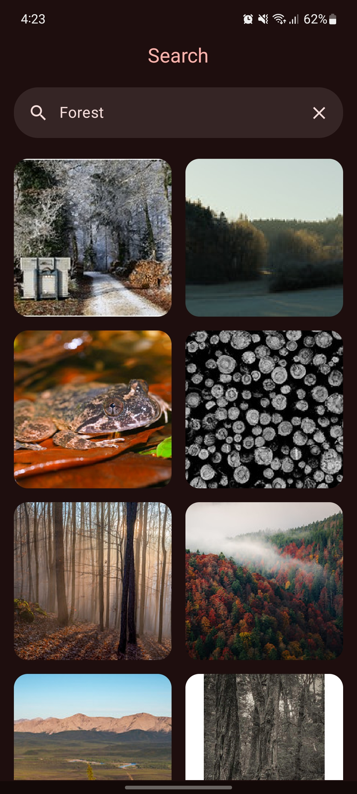
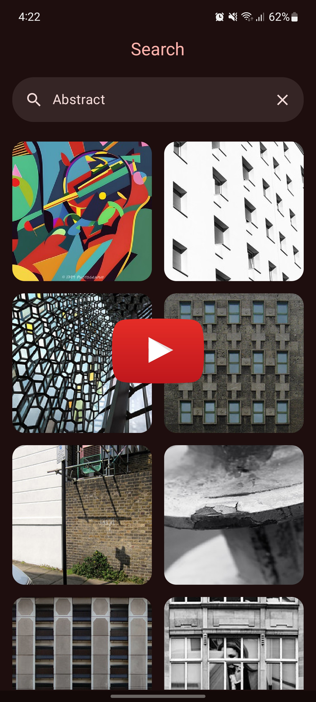

# Test Flickr

Test Flickr is a test project built on [Flickr API](https://www.flickr.com/services/api) request.

The application allows:
- To load images by search.
- Navigate to a selected image in higher resolution.
- Store the last query in cache.
- Interact with images using pinch-to-zoom.

## Tech stack & Open-source libraries

- [Kotlin](https://kotlinlang.org): programming language.
- [Compose](https://developer.android.com/compose): modern UI toolkit for declarative UI development.
- [Coroutines](https://github.com/Kotlin/kotlinx.coroutines) + [Flow](https://kotlinlang.org/docs/flow.html): for asynchronous operations.
- [Kotlin Serialization](https://github.com/Kotlin/kotlinx.serialization): for data serialization.
- [Navigation Component](https://developer.android.com/guide/navigation): for navigating between screens.
- [Retrofit](https://github.com/square/retrofit): for making network requests.
- [Dagger](https://github.com/google/dagger): dependency injection framework.
- [Room](https://developer.android.com/training/data-storage/room): for storing downloaded tracks.
- [Paging](https://developer.android.com/topic/libraries/architecture/paging/v3-overview): for paginated data loading.
- [Coil](https://coil-kt.github.io/coil): for loading and displaying images.
- Architecture
    - MVVM
    - Clean Architecture
    - Multi-module architecture

## Screenshots

    
    

## Video

